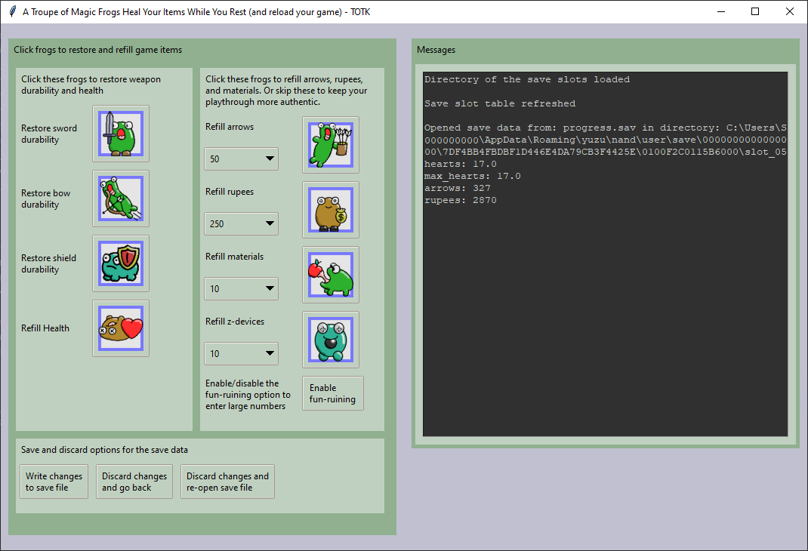

## The Description  
A small app that allows a player to modify their Zelda TOTK gamesaves directly in their 
emulator's game directory. When the TOTK game auto-saves or manual-saves, a player 
can refresh this app, click its options, and then reload their game from the TOTK pause 
menu. The process is designed to be quick and simple.

When the game reloads from the modified gamesave data, the player can have full durability 
of their swords, bows, and shields. This app can also refill hearts, arrows, rupees, and 
material quantities. This app is meant to maintain the fun of finding new types of items, 
so it does not give the player new items but simply restores or refills the player's current items.

## The Lore
I was thinking, instead of using duplication glitches, it would be nice if my character 
could take a rest while a Santa Claus-like being repaired my weapons and maybe filled my 
stockings with a few rupees and item refills.

So that's the basic idea, but instead of Saint Nick we have a troupe of magic frogs whose 
origin is clouded in mystery. Perhaps they operate secretly while our character is sleeping. 
Perhaps they hold the weapons gently and whisper healing incantations. Or, perhaps they 
heat the weapons in a portable froggish forge and pound them into shape while drinking
froggish beverages and singing rowdy froggish melodies. Perhaps they are the size of spring 
peepers, or perhaps they are more like dwarves, or perhaps their size would dwarf a human. 
I leave it to the user to decide.

## Another Angle
I wanted to spend more time enjoying my favorite weapons and items, more time exploring, and 
less time replacing broken weapons. I also didn't want to ruin the fun of finding new types 
of items, so this app was developed with the goal of simply restoring or refilling current items.

Before I developed this app, I was getting a similar game-play experience by using item and 
weapon duplication glitches to prolong the durability of weapons, but weapon duplication 
glitches need you to leave some weapons untouched which is tedious, and performing any glitch 
is a bit tedious anyway. This app replaces the duplication glitches that I had been using.

## Direct Download
Work in progress

## Try App With Test Data  
You can test this app's ability to work on a TOTK gamesave directory structure by downloading 
and unzipping for_testing_only_parent_directory.zip from this repo. You can test this app's 
ability to work on a single TOTK gamesave file by downloading for_testing_only_progress.sav 
from this repo.

## Build Instructions
This project uses Python, Pillow, and pyinstaller.

### Dependencies  
Python 3.11.4  
Pillow 10.0.0  
pyinstaller 5.12.0  

If you clone or download this repo, and you have the dependencies installed, you can open a 
command prompt in the project directory and build the project to a single app file with 
this command.

### Build Command  
`pyinstaller --onefile --windowed --add-data images/*;images main.py`
